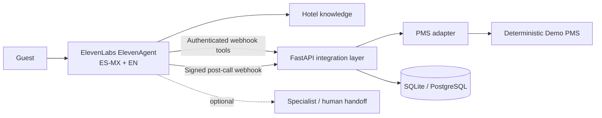

# ElevenLabs Hotel Concierge FDE

**Production-style hiring artifact for ElevenLabs Forward Deployed Engineer — Software Engineer — LATAM.**

An independent Mexican hotel loses reservation opportunities when reception is busy or closed. This project shows how I would scope, build, test, and operate an ElevenAgents-based overflow receptionist without replacing front-desk staff.

## What this proves

- **Customer translation:** operational hotel requirements become explicit product boundaries and measurable outcomes.
- **Python engineering:** FastAPI, Pydantic, SQLAlchemy, typed contracts, tests, idempotency, and security live in code.
- **ElevenLabs fluency:** webhook tools, post-call processing, conversation correlation, agent-transfer boundaries, knowledge, and an Agent Testing scenario catalog are first-class artifacts.
- **Production judgment:** deterministic pricing, authenticated tools, signed webhooks, safe failures, no payment handling, duplicate protection, and explicit real-vs-demo claims.

## Architecture



ElevenLabs owns voice, turn-taking, and conversational orchestration. FastAPI owns deterministic business actions and external-system boundaries.

## Local quick start

```bash
python -m venv .venv
source .venv/bin/activate            # Windows: .venv\Scripts\activate
pip install -e '.[dev]'
cp .env.example .env
uvicorn app.main:app --reload
```

Then:

```bash
python scripts/smoke_test.py
pytest
```

Open `http://127.0.0.1:8000/docs` for the tool API.

## Tool surface

| Endpoint | Purpose |
|---|---|
| `POST /v1/tools/check-availability` | deterministic inventory lookup |
| `POST /v1/tools/quote-stay` | deterministic quote from validated room option |
| `POST /v1/tools/capture-lead` | idempotent guest-intent capture |
| `POST /v1/tools/create-booking-link` | safe non-payment booking URL |
| `POST /v1/tools/request-handoff` | idempotent escalation business event |
| `GET /v1/tools/hotel-information` | deterministic FAQ fallback |
| `POST /v1/webhooks/elevenlabs/post-call` | signed, idempotent post-call processing |

All tool routes require `Authorization: Bearer $TOOL_API_KEY`.

## Real vs demo

**Real in this repository:** Python API, validation, deterministic PMS behavior, persistence, idempotency, HMAC verification, unit/integration tests, tool schemas, prompt invariants, evaluation scenarios, Docker/CI configuration.

**Requires an ElevenLabs account to exercise live:** creating the ElevenAgent, selecting a voice, configuring webhook tools, importing the knowledge base, Agent Testing, and live post-call delivery.

**Intentionally not claimed:** live Cloudbeds/Mews credentials, production PSTN transfer, payment collection, or real reservation creation.

## Reviewer path (5 minutes)

1. Read [`docs/fde-case-study.md`](docs/fde-case-study.md).
2. Read [`agent/prompt.md`](agent/prompt.md) and [`agent/tool-contracts.json`](agent/tool-contracts.json).
3. Inspect [`app/api/tools.py`](app/api/tools.py) and [`app/security/elevenlabs_webhook.py`](app/security/elevenlabs_webhook.py).
4. Scan [`evals/scenarios.yaml`](evals/scenarios.yaml).
5. Run `pytest`.

## Documentation

- [Architecture](docs/architecture.md)
- [Customer discovery](docs/customer-discovery.md)
- [Failure modes](docs/failure-modes.md)
- [Demo script](docs/demo-script.md)
- [ElevenLabs setup](docs/elevenlabs-setup.md)
- [FDE case study](docs/fde-case-study.md)

## Success metrics

A real pilot would track: recovered booking-intent conversations, successful availability checks, booking-link delivery, qualified leads captured, escalation rate, tool error rate, p95 tool latency, and **zero false reservation confirmations / payment-data captures**.
