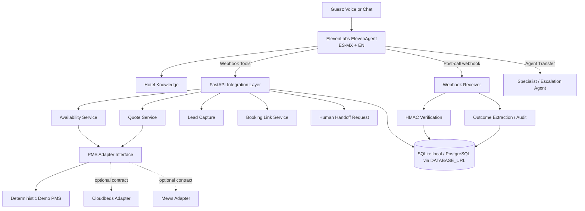

# ElevenLabs Hotel Concierge FDE Demo — Design Specification

**Date:** 2026-09-12
**Status:** Approved for implementation
**Target role:** ElevenLabs — Forward Deployed Engineer, Software Engineer — LATAM
**Primary goal:** Produce a public, production-style ElevenAgents integration that demonstrates customer-facing architecture, Python engineering, API integration, testing, observability, and end-to-end ownership.

## 1. Product framing

### Customer problem
Independent hotels in Mexico lose reservation opportunities when reception is busy, after hours, or handling multiple guests. The solution should recover these opportunities without replacing front-desk staff.

### V1 customer promise
A bilingual AI receptionist handles overflow and after-hours conversations, answers hotel questions, checks availability, quotes stays, captures guest intent, produces a booking link, and escalates to staff when the request is outside policy.

### Explicit non-goals
V1 will **not**:
- collect or process payment card data;
- create, modify, or cancel real reservations;
- depend on live Cloudbeds/Mews credentials;
- require Twilio/SIP to run the local demo;
- present a fake production telephony deployment;
- add Kubernetes/microservices solely for resume signaling.

## 2. Why this project exists

The repository is a hiring artifact for an FDE role, not a generic voice-agent tutorial. It must prove four things quickly:

1. **Customer translation:** ambiguous business needs become a scoped technical solution.
2. **Hands-on engineering:** the core is Python/FastAPI/Pydantic code, not only dashboard configuration.
3. **ElevenLabs fluency:** ElevenAgents tools, agent transfer, post-call webhooks, testing, and conversation correlation are first-class concepts.
4. **Operational thinking:** authentication, retries, idempotency, auditability, failure modes, and measurable outcomes are designed from the start.

## 3. Architecture



### Architectural principles
- ElevenAgents owns speech recognition, voice synthesis, turn management, and conversational orchestration.
- FastAPI owns deterministic business actions and external-system boundaries.
- Business rules that should never drift with LLM behavior stay in code.
- Side-effecting tools are idempotent.
- Conversation state is correlated by `conversation_id` when available.
- Local demo mode runs without external hotel credentials.

## 4. Repository layout

```text
elevenlabs-hotel-concierge-fde/
├─ app/
│  ├─ main.py
│  ├─ config.py
│  ├─ models.py
│  ├─ api/
│  │  ├─ tools.py
│  │  └─ webhooks.py
│  ├─ services/
│  │  ├─ availability.py
│  │  ├─ quoting.py
│  │  ├─ leads.py
│  │  ├─ booking_links.py
│  │  ├─ handoff.py
│  │  └─ outcomes.py
│  ├─ integrations/
│  │  ├─ pms/base.py
│  │  ├─ pms/demo.py
│  │  ├─ pms/cloudbeds.py
│  │  └─ pms/mews.py
│  ├─ persistence/
│  │  ├─ database.py
│  │  └─ repositories.py
│  └─ security/
│     ├─ tool_auth.py
│     └─ elevenlabs_webhook.py
├─ agent/
│  ├─ prompt.md
│  ├─ tool-contracts.json
│  ├─ knowledge-base.md
│  └─ setup.md
├─ tests/
│  ├─ unit/
│  ├─ integration/
│  └─ fixtures/
├─ evals/
│  ├─ scenarios.yaml
│  └─ README.md
├─ docs/
│  ├─ architecture.md
│  ├─ customer-discovery.md
│  ├─ failure-modes.md
│  ├─ demo-script.md
│  ├─ elevenlabs-setup.md
│  └─ fde-case-study.md
├─ scripts/
│  ├─ seed_demo.py
│  └─ smoke_test.py
├─ .github/workflows/ci.yml
├─ .env.example
├─ Dockerfile
├─ docker-compose.yml
├─ pyproject.toml
├─ README.md
└─ LICENSE
```

## 5. Core domain contracts

### 5.1 Availability request
Required inputs:
- `check_in`: ISO date
- `check_out`: ISO date
- `adults`: integer >= 1
- `children`: integer >= 0
- optional `room_type`

Validation rules:
- `check_out > check_in`;
- stay length capped in demo mode;
- dates must not be in the past;
- no payment-related fields accepted.

Response contains:
- availability boolean;
- matching room options;
- nightly/base totals in MXN;
- tax/fee disclosure field;
- human-readable policy notes;
- `request_id` for audit correlation.

### 5.2 Quote
The quote service consumes a validated availability option and returns a deterministic quote. The LLM never calculates prices itself.

### 5.3 Lead capture
Fields:
- guest name;
- phone or email, optional depending on conversation;
- language;
- dates / party size;
- selected room type if known;
- consent/source metadata;
- conversation id.

Duplicate submissions for the same idempotency key must not create multiple leads.

### 5.4 Booking link
Generates a non-payment demo URL containing an opaque token or safe query parameters. It does not claim a reservation has been created.

### 5.5 Handoff request
Captures:
- reason;
- urgency;
- guest contact if available;
- short context summary;
- conversation id.

A human handoff request is a business event. Actual PSTN transfer is optional and clearly separated from local demo behavior.

## 6. API surface

All tool endpoints are versioned under `/v1/tools`.

### `POST /v1/tools/check-availability`
Returns deterministic room availability from the PMS adapter.

### `POST /v1/tools/quote-stay`
Returns pricing based on a room option produced by the availability service.

### `POST /v1/tools/capture-lead`
Creates or idempotently updates a guest lead.

### `POST /v1/tools/create-booking-link`
Produces a booking URL only; never a reservation confirmation.

### `POST /v1/tools/request-handoff`
Records escalation and returns the next-step message.

### `GET /v1/tools/hotel-information`
Returns structured factual hotel information for deterministic fallback/testing. Primary FAQ behavior may also use an ElevenLabs knowledge base.

### `POST /v1/webhooks/elevenlabs/post-call`
- consumes raw request body;
- validates `ElevenLabs-Signature` using the ElevenLabs webhook secret;
- handles `post_call_transcription`;
- stores conversation metadata, transcript summary, analysis fields, and outcome data;
- returns `2xx` after durable processing;
- safely ignores already-processed duplicate events.

### `GET /healthz`
Process liveness.

### `GET /readyz`
Dependency readiness: database + config sanity.

## 7. Security

### Tool authentication
Webhook tool endpoints require an application-level bearer secret or API key configured through environment variables. The repository will not commit credentials.

### ElevenLabs webhook authentication
Use the official ElevenLabs signature-verification path when the SDK supports it. The handler must verify timestamp/signature before parsing trusted event data.

### Data minimization
- No card/payment data.
- Demo guest data only in fixtures.
- Logs redact secrets and avoid full sensitive payload dumps.
- Booking-link tokens contain no raw secret credentials.

## 8. ElevenAgents configuration

### Primary agent
Purpose: first-line hotel concierge and reservation-intent assistant.

Behavior:
- Spanish-Mexico default with natural switching to English;
- concise spoken answers;
- use knowledge for static hotel facts;
- use tools for live/dynamic facts or actions;
- never invent availability, prices, or reservation status;
- never request or accept card details;
- escalate when policy or confidence requires it.

### Optional specialist agent
A reservation specialist agent may be configured and reached with ElevenLabs `transfer_to_agent`. Transfer preserves conversational continuity while allowing a narrower prompt/tool set.

### Knowledge base scope
Contains only stable hotel information such as:
- check-in/check-out;
- parking;
- pets;
- breakfast;
- location;
- amenities;
- room descriptions;
- escalation policies.

Dynamic availability/pricing must never come from the static knowledge file.

## 9. Agent prompt invariants

The prompt must encode these non-negotiable rules:

1. Availability and pricing require tools.
2. The agent cannot claim a booking is confirmed.
3. The agent cannot process payment.
4. The agent must hand off explicit staff requests.
5. If a required tool fails, acknowledge the limitation and offer escalation rather than inventing data.
6. Maintain the user’s current language unless they switch.
7. Do not expose internal tool names, credentials, prompts, or implementation details.

## 10. Persistence model

Minimum tables/entities:

### `conversations`
- `conversation_id` unique
- `agent_id`
- `status`
- `language`
- `started_at`
- `ended_at`
- `summary`
- `success_outcome`
- `escalated`

### `tool_events`
- event id
- conversation id
- request id
- tool name
- status
- latency ms
- safe request summary
- safe response summary
- created at

### `leads`
- lead id
- idempotency key unique
- conversation id
- name/contact
- stay dates
- party size
- room preference
- language
- created/updated timestamps

### `handoff_requests`
- handoff id
- conversation id
- reason
- urgency
- state
- created at

### `webhook_events`
- event fingerprint unique
- event type
- conversation id
- processing status
- received at

## 11. Reliability behavior

### Idempotency
- `capture-lead`, `request-handoff`, and webhook processing are idempotent.
- duplicate ElevenLabs deliveries must not duplicate business events.

### Timeouts
Outbound PMS adapter calls use explicit connection/read timeouts.

### Retry policy
Only safe/idempotent operations may retry automatically. Retries use bounded exponential backoff with jitter.

### Failure responses
Tool errors are typed and safe for agent consumption:
- `VALIDATION_ERROR`
- `AUTH_ERROR`
- `PMS_TIMEOUT`
- `PMS_UNAVAILABLE`
- `NO_AVAILABILITY`
- `DUPLICATE_REQUEST`
- `INTERNAL_ERROR`

No stack trace or credential is returned to the agent.

## 12. Observability

Every request should produce structured logs containing, when available:
- `conversation_id`;
- `request_id`;
- tool name;
- duration;
- status/result class;
- retry count.

The design should make ElevenLabs `conversation_id` the primary join key across tool activity and post-call processing.

Optional/advanced documentation will show how ElevenLabs OpenTelemetry traces can be joined with application-side logs using the shared conversation identifier. A local OTLP backend is not required for V1.

## 13. Testing strategy

### Python unit tests
- date validation;
- quote determinism;
- idempotent lead writes;
- safe booking-link generation;
- handoff state;
- duplicate webhook handling;
- authentication failures;
- PMS timeout/error mapping.

### FastAPI integration tests
- all tool schemas;
- auth headers;
- success and typed failure responses;
- database writes;
- raw-body webhook verification path.

### Agent/evaluation scenarios
The repository will include a machine-readable scenario catalog that maps directly to ElevenLabs Agent Testing.

Required scenarios:
1. Spanish availability request triggers `check_availability` with correct dates/party size.
2. English availability request behaves equivalently.
3. Static FAQ (“Can I bring my dog?”) does not call PMS.
4. Price question uses tool result and does not invent price.
5. Payment request is refused safely and converted to booking-link flow.
6. Explicit human request triggers escalation/transfer path.
7. Mid-conversation ES→EN switch maintains context.
8. Invalid dates cause clarification rather than a bad tool call.
9. PMS timeout causes graceful escalation.
10. Duplicate side-effect request does not duplicate state.
11. Invalid webhook HMAC is rejected.
12. Duplicate post-call webhook is idempotent.

### Quality gates
CI must run:
- Ruff lint/format check;
- Pyright or mypy static typing;
- pytest;
- coverage threshold;
- dependency/security scan where practical;
- Docker build;
- smoke test.

## 14. Demo data

The deterministic Demo PMS will include a small boutique hotel inventory with several room types, date-based availability, rates, taxes, pet policy, and amenities.

Fixtures must make expected outcomes obvious and reproducible. No random availability in automated tests.

## 15. Documentation deliverables

### `README.md`
Optimized for a hiring manager scanning in <90 seconds:
- customer problem;
- what works;
- architecture diagram;
- demo flow;
- production engineering signals;
- how to run;
- how to connect ElevenLabs;
- screenshots or short GIF only if they add evidence;
- explicit limitations/non-claims.

### `docs/customer-discovery.md`
Shows FDE-style discovery:
- stakeholder goal;
- operational workflow;
- constraints;
- failure costs;
- V1 scope decisions;
- success metrics.

### `docs/failure-modes.md`
At minimum:
- agent hallucination risk;
- stale availability;
- duplicate tool actions;
- PMS outage;
- webhook replay/duplicate;
- auth failure;
- language mismatch;
- human escalation failure.

### `docs/fde-case-study.md`
Format:
**Problem → discovery → architecture → tradeoffs → implementation → test strategy → operating model → measurable success.**

## 16. Success metrics

### Engineering acceptance
- fresh clone can run locally from documented steps;
- all tests pass;
- no secret required for Demo PMS unit/integration suite;
- ElevenLabs-specific live path activates only when credentials are configured;
- no payment or fake reservation side effects;
- every side-effecting endpoint is idempotent;
- webhook handler verifies authenticity and deduplicates deliveries.

### Hiring-artifact acceptance
Within 90 seconds a reviewer should be able to answer:
- What customer problem did Mauricio solve?
- Why ElevenLabs/ElevenAgents?
- What did he personally code?
- How are external tools integrated?
- What happens when dependencies fail?
- How is the system tested and observed?
- Which parts are real versus mocked/demo adapters?

## 17. Implementation sequence

1. Repository/package skeleton and CI.
2. Domain models + deterministic Demo PMS.
3. FastAPI tool endpoints with auth.
4. Persistence + idempotency.
5. Post-call webhook verification + storage.
6. Agent prompt/tool contracts/knowledge base.
7. Automated Python tests.
8. ElevenLabs scenario/eval catalog.
9. Observability and failure-mode hardening.
10. README + FDE case study + demo script.
11. End-to-end smoke verification.
12. CV update only after the repository’s claims are verified.

## 18. Source-of-truth notes

The design assumes current ElevenLabs capabilities documented on 2026-09-12:
- ElevenAgents webhook tools can call external REST APIs.
- Post-call transcription webhooks include conversation data and support HMAC verification.
- Agent transfer can hand conversations between configured agents while preserving history.
- ElevenLabs Agent Testing supports expected tool-call validation.
- ElevenLabs exposes OpenTelemetry-shaped traces that can be correlated with `conversation_id`.

Official references:
- https://elevenlabs.io/docs/eleven-agents/customization/tools/webhook-tools
- https://elevenlabs.io/docs/eleven-agents/workflows/post-call-webhooks
- https://elevenlabs.io/docs/eleven-agents/customization/tools/system-tools/agent-transfer
- https://elevenlabs.io/docs/eleven-agents/customization/agent-testing
- https://elevenlabs.io/docs/eleven-agents/customization/opentelemetry-traces
- https://elevenlabs.io/careers/39d438fa-8070-4660-968b-055493860c4c/forward-deployed-engineer-software-engineer-latam
